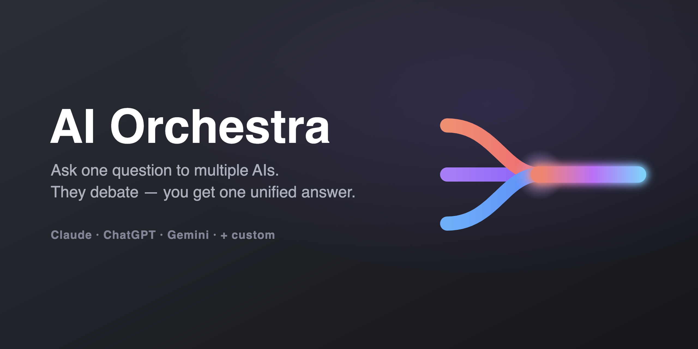
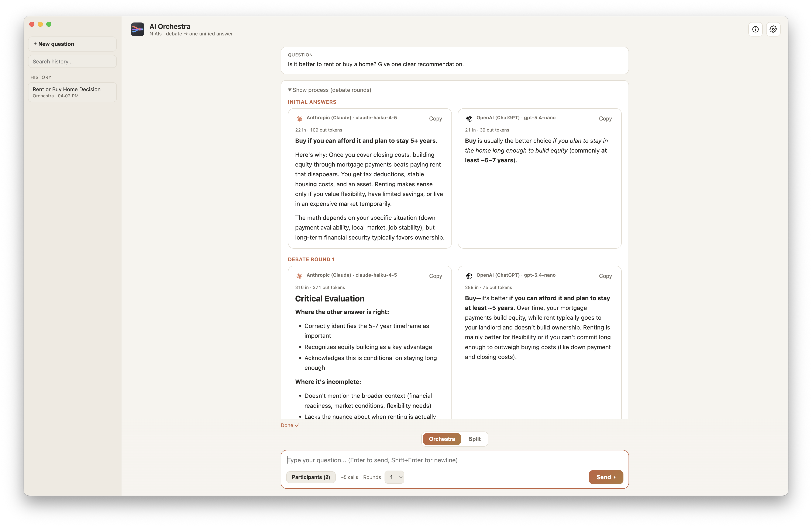
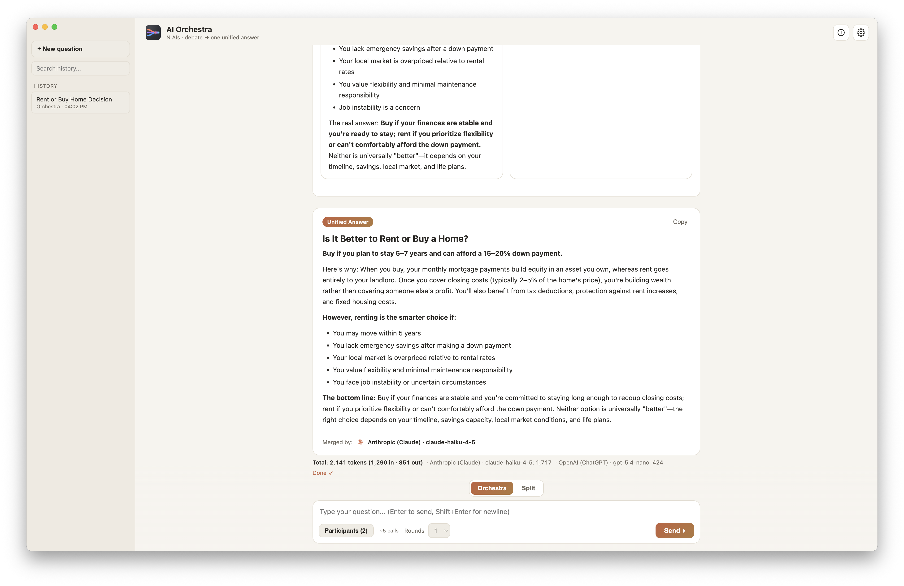

<p align="center">
  
</p>

<h1 align="center">AI Orchestra</h1>

<p align="center">
  Ask one question to multiple AIs. They debate each other — you get one unified answer.
</p>

<p align="center">
  
  
  
</p>

---

## What it does

AI Orchestra is a macOS desktop app. You type one question. It sends that question to
several AI models at the same time (Claude, ChatGPT, Gemini, and any OpenAI-compatible
model you add). The models then **review each other's answers**, and a final model merges
everything into **one clear answer**.

## Features

- **Orchestra mode** — models answer, critique each other for 1–5 rounds, then a judge writes one final answer.
- **Split mode** — see each model's answer side by side, no debate.
- **Many providers** — Claude, ChatGPT, Gemini built in. Add any OpenAI-compatible API (xAI, DeepSeek, OpenRouter, local Ollama, …) with just a base URL.
- **Model picker** — choose models from a dropdown (cheap → expensive), or type a model id by hand.
- **Token usage** — see input/output tokens per model and per run.
- **History** — every conversation is saved, auto-named, and searchable. Continue old chats (each chat keeps its own memory).
- **Two languages** — English and Turkish. Follows your system language, remembers your choice.
- **Daily model refresh** — the live model list updates once a day (and on demand).
- **Private by design** — API keys are stored encrypted in the macOS Keychain. Nothing is sent anywhere except the AI providers you choose.

## Screenshots

<p align="center">
  
  
</p>

<p align="center">
  <em>Left: each model answers, then critiques the others. Right: the judge merges everything into one answer, with per-model token usage.</em>
</p>

## What's new (v1.2.0)

- Readable code blocks in light theme (syntax highlighting follows the theme).
- Error logging to `~/.ai-orchestra/error.log` (open from Help → Open Logs Folder).
- Fixed the "app is damaged" message some users saw after downloading.
- App version and date shown in the corner.

See the full [CHANGELOG](CHANGELOG.md).

## How it works

```
Your question
     │
     ├──► Claude  ─┐
     ├──► ChatGPT ─┤  1) all answer in parallel
     └──► Gemini  ─┘
                   │
                   ▼  2) each model reads the others and improves its answer (N rounds)
                   │
                   ▼  3) a judge model merges everything
                   │
              One unified answer
```

## Download

Grab the latest `.dmg` from the [Releases page](https://github.com/ahmetrende/ai-orchestra/releases),
open it, and drag **AI Orchestra** into Applications.

> **First launch on macOS.** The app is signed but not notarized (no paid Apple Developer
> account yet), so macOS blocks it the first time. If you see **"AI Orchestra is damaged"**
> or **"unidentified developer"**, run this once in Terminal — it clears the download flag:
>
> ```bash
> xattr -dr com.apple.quarantine "/Applications/AI Orchestra.app"
> ```
>
> Then open the app normally. (You can also try right-click → Open, but the Terminal command
> always works.) Or just run it from source (below) to skip this entirely.

## Getting started

You need API keys for the providers you want to use
([Anthropic](https://console.anthropic.com), [OpenAI](https://platform.openai.com),
[Google AI Studio](https://aistudio.google.com)).

```bash
git clone https://github.com/ahmetrende/ai-orchestra.git
cd ai-orchestra
npm install
npm start
```

On first launch, open **Settings (⚙)** and paste your API keys. Then type a question and hit **Send**.

## Build a macOS app

```bash
npm run dist        # creates a .dmg in dist/
```

Or build an unsigned `.app` for local use:

```bash
npx electron-builder --mac --arm64
```

## Where your data lives

Everything stays on your Mac, in `~/.ai-orchestra/`:

- `config.json` — settings and API keys (keys are Keychain-encrypted)
- `history.json` — your conversations
- `models-cache.json` — the cached model list

This folder is kept even if you delete and reinstall the app.

## Tech

Electron · vanilla JS (no build step) · `marked` + `highlight.js` for Markdown/code rendering.

## Credits

Built with these open-source projects (bundled in `src/vendor/`):

- [marked](https://github.com/markedjs/marked) — Markdown parser (MIT)
- [highlight.js](https://github.com/highlightjs/highlight.js) — code syntax highlighting (BSD-3-Clause)
- [DOMPurify](https://github.com/cure53/DOMPurify) — HTML sanitizer (Apache-2.0 / MPL-2.0)
- [@lobehub/icons](https://github.com/lobehub/lobe-icons) — AI provider brand logos (MIT)
- [Electron](https://github.com/electron/electron) — desktop runtime (MIT)

Provider names and logos (OpenAI, Claude, Google Gemini, …) are trademarks of their
respective owners and are used only to indicate compatibility.

## License

MIT


---

Made by [Ahmet Rende](https://www.linkedin.com/in/ahmetrende/) · [GitHub](https://github.com/ahmetrende)
